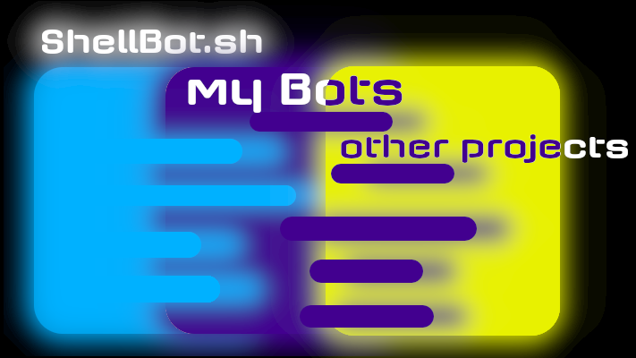

 
# bots para telegram em ShellScript
Projeto Open Source para ajudar na criação e estudo de Shell Script, com a Criação de Bots para a plataforma Telegram, utilizando a API ShellBot.sh :
https://github.com/shellscriptx/ShellBot/wiki

## objetivo geral
Promover a linguagem ShellScript, nativa da plataforma Linux, uma plataforma de código aberto que revoluciona o conceito de evolução de projetos e conhecimento livre. este projeto também visa facilitar a criação de Bots para a plataforma do telegram de inumeras maneiras diferentes, desde bots simples até algo mais complexo, usando recursos nativos do sistema, e/ou programas externos operados por linha de comando. amo a linguagem, e gostaria de ver ela incluida em diversos outros projetos, pela sua facilidade e eficiência em execusão e tratamento de dados com poucas linhas de código.

OBS: em cada pasta deste repositório, está uma aba descritiva do funcionamento de cada bot, com passos para se testar e utilizar no telegram. "descrições em formação, visite as issues para acompanhar o desenvolvimento do projeto, e as descrições concluidas"

compartilhe no telegram:
[compartilhar via telegram](https://t.me/share/url?url=https://github.com/fabriciocaetano/bots-para-telegram-em-ShellScript&text='projeto open-source Bots Telegram em ShellScript')

ficarei grato com uma avaliação, doação, critica construtiva, ou uma estrela 🌟!

[doar](https://www.mercadopago.com.br/checkout/v1/redirect?pref_id=535976028-fcf66071-6c7b-49f8-a786-92e1d75ca74c)

## Licença

Este projeto está licenciado sob a licença MIT - consulte o arquivo [licença](https://github.com/fabriciocaetano/bots-para-telegram-em-ShellScript/blob/master/LICENSE) para obter detalhes
