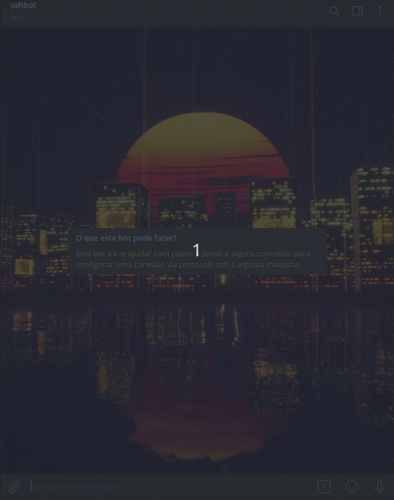
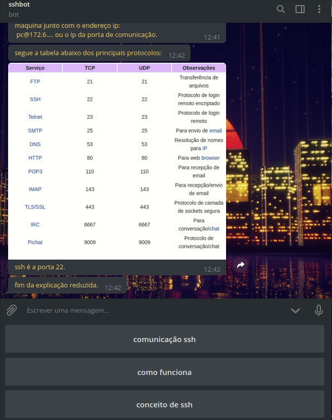
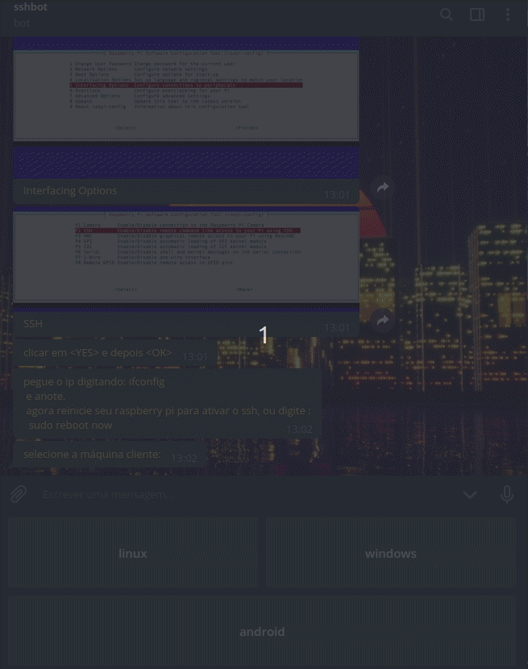

# Bot de Configuração SSH
este bot tem como objetivo ajudar o usuário final a conseguir configurar uma comunicação ssh, selecionando a máquina remota a utilizar, e selecionando a máquina que irá controlar a distância.
você seleciona as opções e ele mostra passo a passo como realizar a configuração de acordo com sua necessidade.

## objetivo
este bot tem o objetivo de ajduar a usuários comuns ou pessoas que ja entendem um pouco a fazerem uma comunicação ssh por diferentes sistemas, ainda em desenvolvimento. porém ja vimos bons resultados.

## método
utilizamos apenas ShellScript, nenhum programa externos. usando botões seletores para facilitar a navegação do usuário comum, com tempos de parada para o usuário poder acompanhar em quanto realiza a configuração.

## iniciando com o bot

## escolhendo a máquina de configuração

## e depois a máquina de destino

