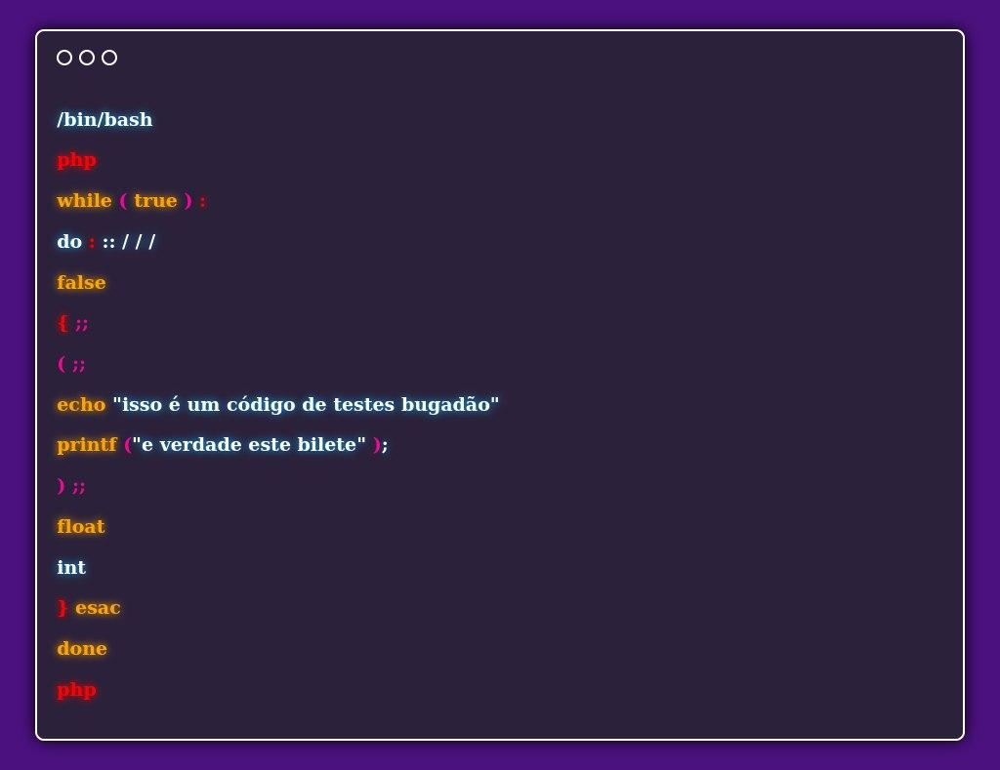
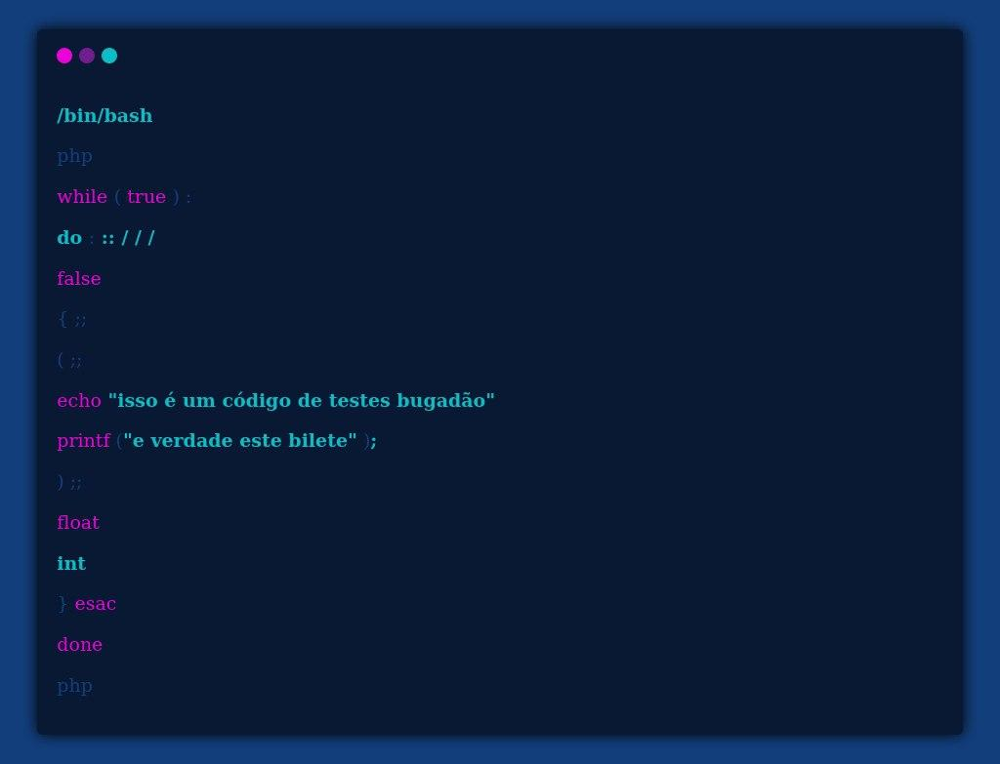

# bot de criação de códigos apresentaveis em imagem tematizada, baseada em carbon

  
  

#principio de funcionamento
o bot recebe uma solicitação do tema seguido do código, então com base no comando recebido, ele pega uma váriável que contenha elementos html e css com o estilo visual, e grava em um arquivo novo com a ID do usuário do telegram.
o bot possui em seu inicio uma sequência de variáveis, que são usadas para montar a página html com css do zero, com variaveis de montagem de topo, uma parte variável de acordo com cada estilo, e a variavel de fim, que grava elementos como </h3>
</html>,
quando ele chega na metade da estrutura de montagem, ele trata a menssagem enviada pelo usuário e começa a usar "filtros", que identifiquem partes do código para colorir utilizando o comando SED.
em seguida o código tratado é gravado no html formado, e o seu restante é finalizado com a ultima variável de html/css.
após a criação unica do arquivo com a ID e menssagem do usuário, o bot utiliza o wkhtmltoimage, pois o memso consegue interpretar URL, arquivos estáticos para gerar PDF e imagens, penssando nisso, ele pode interpretar o arquivo html gerado pelo bot e gerar uma imagem com o tamanho do código ejetado na montagem do arquivo, criando assim uma imagem bonita do código salva também com a 
ID, que é enviada ao telegram, e tem os arquivos gerados deletados em seguida, para não gerar inundação do servidor ou maquina.
