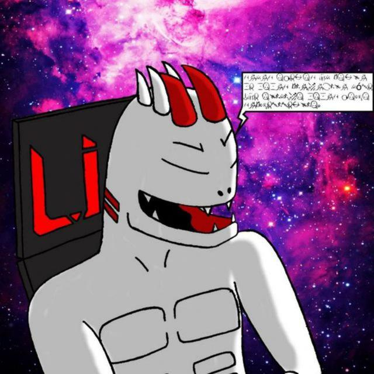
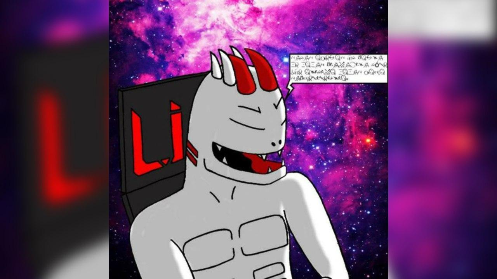

# imagedit
## bot editor de imagem
imagedit é um bot em shellscript criado para a plataforma telegram, com o intuito de receber arquivos de imagens em formato comum, ou sendo enviada em forma de arquivo.
o bot recebe a imagem, define uma resolução padrão de 4k como padrão: 3840x2160, e uma resolução alternativa de :2560x1440 de saída, colocando efeitos nas imagens de forma programática com imagemagick, um programa que permite a manipulação de imagens em níveis profundos e precisos utilizando a programação, permitindo a criação de textos, objetos em 3d e modelagem nas fotos, mudanças de cores, canais alfas, escritas, ângulos e inúmeros efeitos com animações, sua documentação pode ser vista aqui:
[imagemagick](https://www.imagemagick.org/Usage/)
# exemplos da saída do bot:
## imagem original de entrada:

## imagem de saída do bot:

OBS: eu sou o aoutor desta imagem utilizada neste exemplo e perfil, além de outros inúmeros conjuntos de imagem criadas por mim. esta imagem é a representação de um shinigame criado por mim, seu nome é lil, o deus da morte!.
